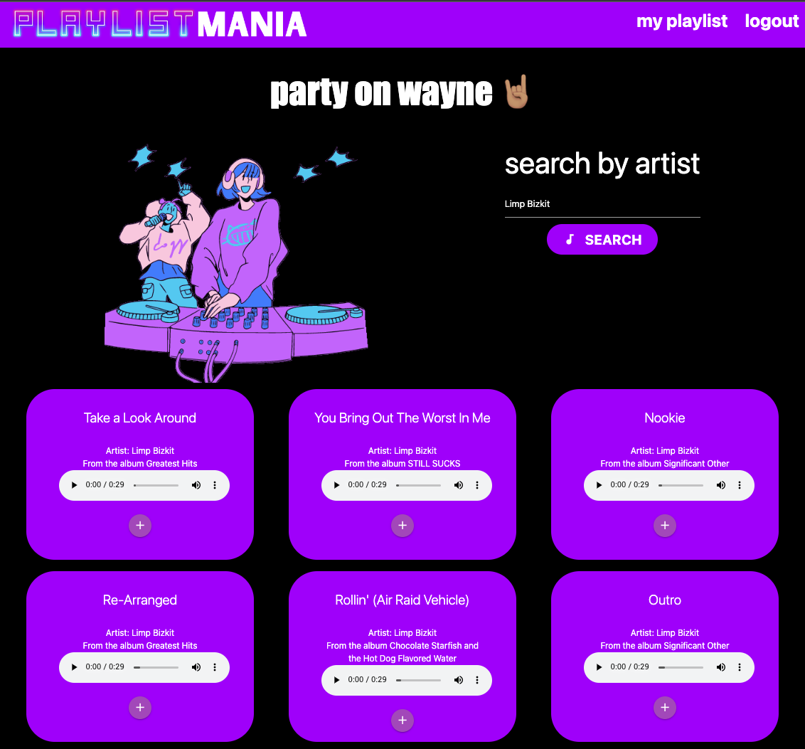
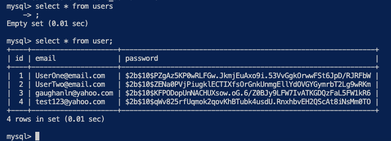

# PlaylistMania 🎧

## Description

Tired of listening to the same chart toppers that play on repeat? Looking for new music? Welcome to Playlist Mania. Here you will be able to search for an artist and explore new songs to add to your favorites and generate your own playlist. The search results will give you samples to listen to so you can decide if you like it before you download it. (Cloud storage is precious these days!) You'll need to login and create an account as well - Music isn't free! 😉 

## 🕺🏽 User Story 💃🏼

As a user, I want to create a secure account with Playlist Mania
so that I can search new music by artist
When I search, the results will provide me with the artist name, song title, album, and sample.
Once I find a song I like, I want to be able to add it to my favorites

## 💾 Technology used

* RESTful API
* Handlebars.js for template engine 
* Use something not discussed in class
  * Materialize for styling
  * The New CSS Reset for resetting the browser defaults
* GET + POST routes
* Include authentication + protect API keys and other sensitive information
* Deploy using Heroku

## 🏆 End Product 
Below are screenshots of various stages of the application + the mysql CLI showing the hashed user information.

<!-- screenshots -->

<!-- link -->
## 💻 Deployment
Here is the [link]() to the deployed Playlist Mania app

## 📓 Contributing + Rough breakdown of tasks

🥲 `Clint Martin` - handlebars routing, refactoring + Heroku deployment

😡 `Jason Shi` - models, routes, api/local storage

🤭 `Joseph Cornelius` - routes, api/local storage

🫠 `Lindsey Gaughan` - Handlebars, CSS, initial file structure + connection, api

